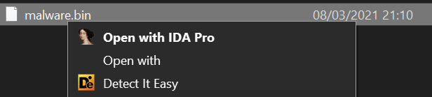

# IdaQuickLaunch

Open file in the right version of IDA Pro (32 or 64bits) from Explorer contextual menu.



## Install (privilieged mode)
> **note :** after installation, please do not move IdaQuickLaunch.exe to another folder.
> 
```IdaQuickLaunch.exe -install``` (auto lookup IDA Folder)

or

```IdaQuickLauch.exe -install IDA_FOLDER_PATH```

## Uninstall (privilieged mode)

```IdaQuickLaunch.exe -uninstall```

## Standalone

```IdaQuickLaunch.exe -run FILEPATH_TO_OPEN```

or

```IdaQuickLaunch.exe -run FILEPATH_TO_OPEN IDA_FOLDER_PATH```

## Extensions
* .exe
* .dll
* .bin

*see end of IdaQuickLaunch.h to add more filetype*